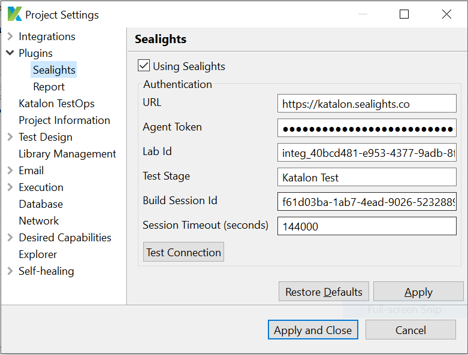

# Katalon Studio Sealight Plugin

## Purpose
This plugin is for integration with Sealights to:
- List of excluded test cases that has been analyzed by previous run to reduce the needed to run all test cases.
- Report the test result back to feed for Sealights Test Analysis.

- This plugin does not include installing Sealights agent or code instrument to collect test coverage.

## How to use
1. Install the plugin either manually or via Katalon store
2. Setup plugin configuration

   

   - Using Sealights: Enable or disable Sealights Plugin.
   - URL: Your sealights url to connect sealights server.
   - Agent Token: Agent token generated from the SeaLights server 
   - Lab Id: Unique ID for a set of test labs in case multiple labs are running simultaneously.
   - Test Stage: Name of the test stage.
   - Build Session Id: Session ID of configuration created.
   - Session Timeout (seconds): Test session timeout (by default: 14400).
1. Create a test suite - Dynamic (v1.0.0+) or Static (v2.0.0+ plus [Sealights Test Listener](https://store.katalon.com/product/416/Sealights-Test-Listener))
    - Create Dynamic test suite.

        When using dynamic test suite, the plugin will get the excluded test cases from Sealights and generate a list of test cases to run.

    - Create Static test suite

        When using a static test suite, the plugin will be responsible for initiating the test session requesting the excluded tests, but you will need to also install the [Sealights Test Listener](https://store.katalon.com/product/416/Sealights-Test-Listener), as it will be responsible for skipping any excluded tests in the suite.

2. Execute the test suite using either Katalon Studio or Katalon Runtime Engine (KRE):
    + Using Katalon Studio

    + Using Katalon Runtime Engine (KRE)

        When using KRE via the command line, you can use the following command line parameters to configure the Sealights plugin:

        #### Sealights command line parameters
        If you don't pass any parameters, then the default value will be taken from within `Katalon Studio` => `Project` => `Settings` => `Plugins` => `Sealights`
      - `-sealightsUrl` : URL connect to sealights server (Optional).
      - `-sealightsAgentToken`: Agent Token (Optional).
      - `-sealightsLabId`:  Lab Id (Optional).
      - `-sealightsTestStage`: Test Stage (Optional).
      - `-sealightsBSId`: Build Session Id (Optional). 
      - `-sealightsSessionTimeout`: Session Timeout (default value is 14400) (Optional).
      - `-sealightsEnableListener`: Enable the [Sealights Test Listener](https://store.katalon.com/product/416/Sealights-Test-Listener) (Optional).

        ** If optional value is not set, It will be default to UI configuration value if it is not set.

        #### For example
        ```
        katalonc -noSplash -runMode=console -projectPath="C:\Users\Katalon Studio\Project\YourProject.prj" -retry=0 -testSuitePath="Test Suites/download" -executionProfile="default" -browserType="Chrome" --config -sealightsUrl="your sealights server" -sealightsAgentToken="your sealights agent token"
        ```

